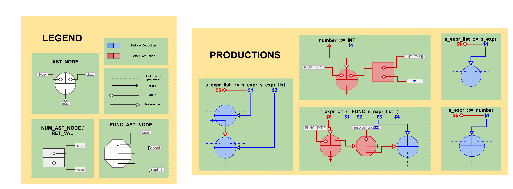

# TASK 1

Recall **Cambridge Polish Notation** (**CPN**), in which operators and their operands are enclosed in parenthesis.

For example, `(add 1 2)` is the **CPN** equivalent of `1+2`.

Expressions in **CPN** can be nested, so the following expression would be valid, and would result in `6`.

```
(add 1 (add 2 3))
```

Your must create a functioning **CPN** calculator which works with the functions listed in the **FUNC_TYPE** enum in the provided code through the **MIN_FUNC** function (all functions appearing after **MIN_FUNC** in the enum will be implemented in later tasks.

This calculator will serve as the core functionality for **CI-LISP**.

You may want to check out the [sample runs](#sample-runs) below better understand what will be implemented before reading further.

The initial grammar is as follows:

```
program ::= s_expr EOL | s_expr EOFT | EOL | EOFT

s_expr ::= f_expr | number | QUIT

f_expr ::= ( FUNC s_expr_section )

s_expr_section ::= s_expr_list | <empty>

s_expr_list ::= s_expr | s_expr s_expr_list

FUNC ::= neg | abs | add | sub |
	mult | div | remainder | exp |
	exp2 | pow | log | sqrt |
	cbrt | hypot | max | min

number ::= INT | DOUBLE

INT ::= optional +/-,
	then some digits

DOUBLE ::= optional +/-,
	then some digits,
	then a decimal point,
	then optionally some more digits
	
QUIT ::= quit
```

The non-terminals **s_expr** and **f_expr** are shorthand:

* **s_expr** means *symbolic* expression
* **f_expr** means *function* expression

## DATA STRUCTURES

Next we'll discuss the structures provided in [cilisp.h](../src/cilisp.h). For a more intuitive understanding of the structures and their names defined here, note that **AST** is short for *__A__bstract __S__yntax __T__ree*. As such, the structures discussed below are intended to house data in an abstract syntax tree.

### NUMBERS

The **NUM\_TYPE** enum and **AST\_NUMBER** struct define everything necessary to house both numeric data types (integers and floating point values) in a single struct.

```c
typedef enum num_type {
    INT_TYPE,
    DOUBLE_TYPE
} NUM_TYPE;

typedef struct {
    NUM_TYPE type;
    double value;
} AST_NUMBER;

typedef AST_NUMBER RET_VAL;
```

Note that even when an **AST\_NUMBER**'s type is **INT\_TYPE**, we will be storing it's actual value as a double under the hood. This is to make function evaluation a little less tedious; students wishing to instead use this alternative **AST\_NUMBER** are welcome to do so:

```c
typedef struct {
    NUM_TYPE type;
    union {
        double floating_point;
        long integral;
    } value;
} AST_NUMBER;
```

Each **AST\_NUMBER** will house a member of the **NUM\_TYPE** enum (denoting the type of number being stored) alongside a numeric value.

The last line, which gives the **AST\_NUMBER** struct a second name (**RET\_VAL**), exists exclusively for readability; when we evaluate a part of our syntax tree, the result will always be a number. We will use **AST\_NUMBER**s to house numbers which are *part of* the syntax tree, and **RET\_VAL**s to house the results of evaulation (*__RET__urned __VAL__ues*).

### FUNCTIONS

The terms "operator" and "function" will be used interchangeably for our discussion here.

We'll start our discussion of functions with the enum and struct definitions in [cilisp.h](../src/cilisp.h).

```c
typedef enum func_type {
    NEG_FUNC,
    ABS_FUNC,
    ADD_FUNC,
    // TODO complete the enum
    CUSTOM_FUNC
} FUNC_TYPE;
```

This enum will list all functions which will be implemented throughout the course of the project. Clearly, it isn't yet complete, hence the `TODO`. You'll add more functions to it as you work through this task, and through future tasks.

When function calls are parsed as **f_expr**s, the data for said calls will be stored in an **AST\_FUNCTION**:

```c
typedef struct {
    FUNC_TYPE func;
    struct ast_node *opList;
} AST_FUNCTION;
```

This struct stores the operator used in the function call (a member of the **FUNC\_TYPE** enum) and the operands for the function (a linked list of **struct ast\_node**s, which we will discuss in the [GENERIC NODES](#generics) section below).

Take note of the **resolveFunc** function defined in [cilisp.c](../src/cilisp.c). This function takes as input a function's name (in string form), and outputs the corresponding **FUNC\_TYPE** member. It will be used to assign value to **FUNC** tokens while lexing.

**resolveFunc** works because the array of function names (**funcNames**, in [cilisp.c](../src/cilisp.c)) lists all functions in the same order as the **FUNC\_TYPE** enum. If either of these is edited, the other must also be edited to match. If they are not kept in sync, **resolveFunc** will not work. **CUSTOM\_FUNC** should be left as the last element of **resolveFunc** for the same reason; user-defined functions will be implemented at the end of the project, and we'll know a function is user-defined if we make it through the whole **funcNames** array without finding the name of the function.

### <a name="generics"></a> GENERIC NODES

We've already discussed two types of abstract syntax tree nodes for housing numbers and functions. In order to make these types of nodes interchangeable, it is necessary to wrap them in a generic abstract syntax tree node which can store either type of node.

As such, we have the **AST\_NODE** type:

```c
typedef enum {
    NUM_NODE_TYPE,
    FUNC_NODE_TYPE
} AST_NODE_TYPE;

typedef struct ast_node {
    AST_NODE_TYPE type;
    union {
        AST_NUMBER number;
        AST_FUNCTION function;
    } data;
    struct ast_node *next;
} AST_NODE;
```

An **AST\_NODE** stores a member of the **AST\_NODE\_TYPE** enum in it's **type** field, so it can be determined what type of node is housed in its **data** field (a union which can store either a **AST\_NUMBER** or a **AST\_FUNCTION**). It also stores a pointer to another **AST\_NODE** in its **next** field, which allows **AST_NODE**s to be stored in a linked list style for use as operands (see the **opList** field in **AST\_FUNCTION**).

## LEXING

First, it is necessary to define all tokens and all non-terminals within the grammar. **token**s (and non-terminals, called **type**s by yacc), will be defined in [cilisp.y](../src/cilisp.y) in the definitions section. The provided token and type definitions are:

```bison
%union {
    double dval;
    int ival;
    struct ast_node *astNode;
};

%token <ival> FUNC
%token <dval> INT
%token QUIT EOL EOFT

%type <astNode> s_expr
```

Clearly, this is incomplete; you should know from the previous labs how to complete this definitions section, and we will not discuss it further here (but as always, questions are welcome).

The union contains all types that **token**s and **type**s will have. In this case, **token** and **type** values will all be stored as *double*, *int* or *ast_node \**.

The tokens defined by the yacc file must be lexed. As we know, the lex file is used to configure a lexer.

The provided [cilisp.l](../src/cilisp.l) is barely started. It has rules to tokenize and return some tokens, but not all of them. You must complete it.

Pay attention to the **llog** calls made for debugging purposes each time a token is created. Just like in the lab, these calls print to a log file `src/bison-flex-outputs/flex_bison_log`. Every rule in [cilisp.l](../src/cilisp.l) should include an **llog** call.

## PARSING

The goal of the parser is to construct an abstract syntax tree after tokenization. Most of the productions in your grammar will have an equivalent production in [cilisp.y](../src/cilisp.y), which is the configuration file for the parser.

The first set of productions in [cilisp.y](../src/cilisp.y) are for parsing programs, which serve as an entry point. The productions are provided, and should be changed cautiously if at all. Productions for `s_expr ::= error` and `s_expr ::= QUIT` are also provided.

```bison
program:
    s_expr EOL {
        ylog(program, s_expr EOL);
        if ($1) {
            printRetVal(eval($1));
            freeNode($1);
        }
        YYACCEPT;
    }
    | s_expr EOFT {
        ylog(program, s_expr EOFT);
        if ($1) {
            printRetVal(eval($1));
            freeNode($1);
        }
        exit(EXIT_SUCCESS);
    }
    | EOL {
        ylog(program, EOL);
        YYACCEPT;  // paranoic; main skips blank lines
    }
    | EOFT {
        ylog(program, EOFT);
        exit(EXIT_SUCCESS);
    };


s_expr:
    QUIT {
        ylog(s_expr, QUIT);
        exit(EXIT_SUCCESS);
    }
    | error {
        ylog(s_expr, error);
        yyerror("unexpected token");
        $$ = NULL;
    };
```

Note that every production has a **ylog** call; this function, like **llog**, prints to the log file stating what lexing and parsing steps are taken. Every production that you add should include a **ylog** file, as well, as the log will be a crucial tool in debugging the lexer and parser.

The rest of the yacc file is up to you. 

The figure below (which can be found [here](../figures/task_1/task_1.png)) may help you visualize what needs to be done. Note that some reductions in the grammar are not illustrated in the figure.



You are **strongly** encouraged to illustrate prouductions like this as you go through the project, and to occasionally draw out entire syntax trees for test inputs.

Many of these productions will need to call the functions declared at the bottom of [cilisp.h](../src/cilisp.h):

```c
AST_NODE *createNumberNode(double value, NUM_TYPE type);
AST_NODE *createFunctionNode(char *funcName, AST_NODE *opList);
AST_NODE *addOperandToList(AST_NODE *newHead, AST_NODE *list);
```

These functions are defined in [cilisp.c](../src/cilisp.c); some of their definitions are partially completed already.

Whenever a function or value needs to be accessible by the lexer or parser, it must be declared in [cilisp.h](../src/cilisp.h).

For instance, in the `number ::= INT` production, you will likely want to assign `$$` (the value of the **number**) to the result of a call to **createNumberNode**, which should create an **AST\_NODE** housing an **AST\_NUMBER** whose data is populated with that from the **INT** token (i.e. its double value) and the type (**INT\_TYPE**, from the **NUMBER\_TYPE** enum). Both **createNumberNode** and **INT\_TYPE** are accessible to the parser because they are declared in [cilisp.h](../src/cilisp.h).

## EVALUATION

### GENERIC EVALUATION

Once parsing is complete (i.e. when a series of tokens is reduced to a sequence `s_expr EOL` or `s_expr EOFT`, the contents of a single program) the **eval** function is called on the root `s_expr`. You can see this call in the provided `program ::= s_expr EOL` production in [cilisp.y](../src/cilisp.y). This function is the entry point for a recursive system of functions whose purpose is to evaluate the syntax tree and output the resulting **RET_VAL**.

While it is generally bad practice to pass structs by value, we will make an exception for the **RET\_VAL** struct, which is sufficiently small for the issue to be irrelevant. Of course, if you wish to pass them around by reference instead, you're welcome to do so.

The **eval** function takes as input a generic **AST\_NODE \***. Its job is to determine which type of **AST\_NODE** is referrenced and call the corresponding function to evaluate it. That is, **eval** must determine if the referenced **AST\_NODE** is of type **NUM\_NODE\_TYPE** or **FUNC\_NODE\_TYPE** and call **evalNumNode** or **evalFuncNode** on it respectively.

This process is similar to the evaluation prodedure carried out in the parser lab; no individual evaluation function should be too complex because of the recursive setup. For instance, when evaluating a function, you must evaluate its operands, but you don't need to do this by hand in **evalFuncNode**; you can instead simply call **eval** on each operand, and use the resulting **RET\_VAL**s as operands for the function evaluation.

### NUMBER EVALUATION

**evalNumNode** should be quick and easy; recall that a **RET\_VAL** is really just an **AST\_NUMBER** under a different name.

### FUNCTION EVALUATION

**evalFuncNode** should check which **FUNC_TYPE** the **AST\_FUNCTION** contains, and call an appropriate function to evaluate the result of running that operation with the input referenced linked list of operands. For instance, if the function being evaluated has type **NEG_TYPE**, you might pass it off to a function called **evalNegFunction** (which you'll need to add).

That is, **evalFuncNode** should be a glorified switch or if/else cascade, which just calls the individual function evaluation procedures. I **strongly** advise against doing said procedures inside of **evalFuncNode** instead of making these helper functions; it's totally doable, but it's also more tedious to read, debug, and expand.

Much of the work in function evaluation is catching and dealing with fringe cases. Often, you will need to print warnings as described in the function desciptions and sample runs below. Use the **warning** function, provided in [cilisp.c](../src/cilisp.c) for this purpose. It is essentically **printf** with a couple extra features to keep the console output pretty and well spaced. It also prepends "WARNING: " onto whatever formatted string you pass it.

## FUNCTION SPECIFICATIONS

Unary functions take 1 operand, binary take 2 operands, and *n*-ary take any number of operands. Functions which are given too few operands should print warnings and return `NAN_RET_VAL` (defined in [cilisp.h](../src/cilisp.h) unless otherwise specified below. Functions which are given too many operands should print warnings stating that the extra operands were ignored, and then only use the required number of operands in calculation. If extra operands are provided, the leftmost operands should be used and the extras on the right ignored.

Check out the **math.h** library (open the console and type `man math` to get its documentation) before starting these implementations. Be careful: many of the **math.h** library functions don't behave as the specifications below describe, despite similar nomenclature. For instance, **math.h**'s **remainder** can return a negative value, but the specifications for the **remainder** function below specify that the result must be positive.

* neg
	* unary
	* returns the negation of the operand
	* i.e. given *x* returns -*x*
* abs
	* unary
	* returns the absolute value of the operand
* add
	* *n*-ary
	* returns the sum of its operands
	* return type depends on input types
	* if given no inputs, prints warning and returns *0* as an integer
* sub
	* binary
	* returns result of subtracting second operand from first operand
	* return type depends on operand types
* mult
	* *n*-ary
	* returns the product of the operands
	* return type depends on operand types
	* if given no inputs, prints warning and returns 1 as an integer
* div
	* binary
	* returns the result of division of the first operand by second operand
	* return type depends on operand types
	* int division if done with 2 integers
* remainder
	* binary (*a* and *b* input)
	* returns an *r* such that:
		* *a* = *q* \* *b* + *r*
		* *q* is an integer
		* *0* <= *r* < | *b* |
* exp
	* unary
	* returns _e_ raised to the specified power
	* always returns a double
* exp2
	* unary
	* returns _2_ raised to the specified power
	* if operand is negative, return type is always double
	* otherwise, return type depends on operand type
* pow
	* binary
	* returns first operand raised to power of second operand
	* return type depends on operand types
* log
	* unary
	* returns natural log of operand
	* always returns a double
* sqrt
	* unary
	* returns the square root of the operand
	* always returns a double
* cbrt
	* unary
	* returns the cube root of the input
	* always returns a double
* hypot
	* *n*-ary
	* returns the square root of the sum of squares of operands
	* if given no inputs, prints a warning and returns 0
	* always returns a double
	* `math.h`'s `hypot` only take 2 arguments; you'll need to build this by hand
* max
	* *n*-ary
	* returns maximum value among the operands
	* return type is the type of the maximum operand
	* if given no operands, throws an error
* min
	* *n*-ary
	* returns minimum value among the operands
	* return type is the type of the minimum operand
	* if given no operands, throws an error

## <a name="sample-runs"></a>SAMLPLE RUNS

In the sample runs below, inputs are on the same line as the `> `, and the output is printed below (along with any warnings). The inputs shown in these sample runs are all provided in the `inputs/task_1` directory. You can edit the run configurations to provide a path to an input file, or run without any arguments and type inputs in by hand. The provided input files have `quit` so sample runs match runs done by hand, but this is unnecessary with file inputs; the program will end when an `EOF` is encounters as well.

You are encouraged to come up with a composite test input of your own, to test all of task 1, once your implementation matches the sample runs for all provided inputs.

When you're done implementing your lexing, parsing and evaluation procedures to match the sample runs below, don't forget to read the [CLEANING UP](#cleaning_up) section below.

### number

```
> 0
Integer : 0

> 0.
Double : 0.000000

> 1
Integer : 1

> 1.
Double : 1.000000

> 0.0
Double : 0.000000

> 0.5
Double : 0.500000

> +0
Integer : 0

> +10.55
Double : 10.550000

> -12.87
Double : -12.870000

> -12.
Double : -12.000000

> -12
Integer : -12

> .34 
WARNING: Invalid character >>.<<
Integer : 34

Process finished with exit code 0
```

### neg
```
> (neg 5)
Integer : -5

> (neg 5.5)
Double : -5.500000

> (neg -5.0)
Double : 5.000000

> (neg -5)
Integer : 5

> (neg)
WARNING: neg called with no operands! nan returned!
Double : nan

> (neg 1 2)
WARNING: neg called with extra (ignored) operands!
Integer : -1

> quit 

Process finished with exit code 0
```

### abs
```
> (abs 1)
Integer : 1

> (abs 1.2)
Double : 1.200000

> (abs -3)
Integer : 3

> (abs 0)
Integer : 0

> (abs 0.0)
Double : 0.000000

> (abs -1.4)
Double : 1.400000

> (abs)
WARNING: abs called with no operands! nan returned!
Double : nan

> (abs -1 2)
WARNING: abs call with extra (ignored) operands!
Integer : 1

> quit 

Process finished with exit code 0
```

### add
```
> (add)
WARNING: add call with no operands, 0 returned!
Integer : 0

> (add 1)
Integer : 1

> (add 1.0)
Double : 1.000000

> (add 1 2 3 4 5)
Integer : 15

> (add 1 -2 3 -4 5 -6)
Integer : -3

> (add 0.0 1 -2 3 -4 5 -6)
Double : -3.000000

> (add 1 -1.0)
Double : 0.000000

> quit 

Process finished with exit code 0
```

### sub
```
> (sub)
WARNING: sub called with no operands!
Double : nan

> (sub 1)
WARNING: sub called with only one arg!
Double : nan

> (sub 1.0)
WARNING: sub called with only one arg!
Double : nan

> (sub 1 2)
Integer : -1

> (sub 2 1)
Integer : 1

> (sub 2 -1)
Integer : 3

> (sub 2.0 1)
Double : 1.000000

> (sub 2.0 -1)
Double : 3.000000

> (sub 1 1.0)
Double : 0.000000

> (sub 2.0 1.0)
Double : 1.000000

> (sub 1 2 3)
WARNING: sub called with extra (ignored) operands!
Integer : -1

> quit 

Process finished with exit code 0
```

### mult
```
> (mult)
WARNING: mult called with no operands! 1 returned!
Integer : 1

> (mult 1)
Integer : 1

> (mult 1.0)
Double : 1.000000

> (mult -1)
Integer : -1

> (mult -1 -1.0)
Double : 1.000000

> (mult 1 -2 3 -4 5)
Integer : 120

> (mult -1.0 2 -3.0 4 -5)
Double : -120.000000

> quit 

Process finished with exit code 0
```


### div
```
> (div)
WARNING: div called with no operands! nan returned!
Double : nan

> (div 1)
WARNING: div called with only one arg! nan returned!
Double : nan

> (div 1.0)
WARNING: div called with only one arg! nan returned!
Double : nan

> (div 1 2)
Integer : 0

> (div 1.0 2)
Double : 0.500000

> (div 2 1)
Integer : 2

> (div 2.0 1)
Double : 2.000000

> (div 5 2.0)
Double : 2.500000

> (div -20.0 4)
Double : -5.000000

> (div 1 2 3 4)
WARNING: div called with extra (ignored) operands!
Integer : 0

> (div 1 2 3)
WARNING: div called with extra (ignored) operands!
Integer : 0

> (div 5.0 2 3)
WARNING: div called with extra (ignored) operands!
Double : 2.500000

> quit 

Process finished with exit code 0
```

### remainder
```
> (remainder)
WARNING: remainder called with no operands! nan returned!
Double : nan

> (remainder 1)
WARNING: remainder called with one arg! nan returned!
Double : nan

> (remainder 0)
WARNING: remainder called with one arg! nan returned!
Double : nan

> (remainder -1.0)
WARNING: remainder called with one arg! nan returned!
Double : nan

> (remainder 1 2)
Integer : 1

> (remainder 2 1)
Integer : 0

> (remainder 2.5 1)
Double : 0.500000

> (remainder 2 3)
Integer : 2

> (remainder -6 10)
Integer : 4

> (remainder -6.0 10.0)
Double : 4.000000

> (remainder -6.0 -10.0)
Double : 4.000000

> (remainder 1 2 3)
WARNING: remainder called with extra (ignored) operands!
Integer : 1

> (remainder 23 7 10)
WARNING: remainder called with extra (ignored) operands!
Integer : 2

> quit 

Process finished with exit code 0
```

### exp
```
> (exp)
WARNING: exp called with no operands! nan returned!
Double : nan

> (exp 1)
Double : 2.718282

> (exp -1)
Double : 0.367879

> (exp 5.0)
Double : 148.413159

> (exp -2.0)
Double : 0.135335

> (exp 1 2)
WARNING: exp called with extra (ignored) operands!
Double : 2.718282

> quit 

Process finished with exit code 0
```

### exp2
```
> (exp2)
WARNING: exp2 called with no operands! nan returned!
Double : nan

> (exp2 1)
Integer : 2

> (exp2 1.0)
Double : 2.000000

> (exp2 0)
Integer : 1

> (exp2 0.0)
Double : 1.000000

> (exp2 0.5)
Double : 1.414214

> (exp2 -2)
Double : 0.250000

> (exp2 20.0)
Double : 1048576.000000

> (exp2 1 2)
WARNING: exp2 called with extra (ignored) operands!
Integer : 2

> quit 

Process finished with exit code 0
```

### pow
```
> (pow)
WARNING: pow called with no operands! nan returned!
Double : nan

> (pow 1)
WARNING: pow called with only one operand! nan returned!
Double : nan

> (pow 1.0)
WARNING: pow called with only one operand! nan returned!
Double : nan

> (pow 1 1)
Integer : 1

> (pow 1 1.0)
Double : 1.000000

> (pow 2 1)
Integer : 2

> (pow 2.1 1)
Double : 2.100000

> (pow -2 0.5)
Double : nan

> (pow -2 0)
Integer : 1

> (pow -2.0 0.0)
Double : 1.000000

> (pow -2.0 0)
Double : 1.000000

> (pow 3 3)
Integer : 27

> (pow 3.0 3)
Double : 27.000000

> (pow 27 (div 1 3.0))
Double : 3.000000

> (pow 1 2 3)
WARNING: pow called with extra (ignored) operands!
Integer : 1

> quit 

Process finished with exit code 0
```

### log
```
> (log)
WARNING: log called with no operands! nan returned!
Double : nan

> (log 1)
Double : 0.000000

> (log 0)
Double : -inf

> (log -1)
Double : nan

> (log 0.0)
Double : -inf

> (log -1.0)
Double : nan

> (log (exp 1))
Double : 1.000000

> (div (log 27) (log 3))
Double : 3.000000

> (div (log 27.0) (log 3))
Double : 3.000000

> (log 1 2)
WARNING: log called with extra (ignored) operands!
Double : 0.000000

> quit 

Process finished with exit code 0
```

### sqrt
```
> (sqrt)
WARNING: sqrt called with no operands! nan returned!
Double : nan

> (sqrt 1)
Double : 1.000000

> (sqrt 1.0)
Double : 1.000000

> (sqrt 0)
Double : 0.000000

> (sqrt 0.0)
Double : 0.000000

> (sqrt -1)
Double : nan

> (sqrt -1.0)
Double : nan

> (sqrt 4)
Double : 2.000000

> (sqrt 170.0)
Double : 13.038405

> (sqrt 2)
Double : 1.414214

> (sqrt 1 2)
WARNING: sqrt called with extra (ignored) operands!
Double : 1.000000

> quit 

Process finished with exit code 0
```

### cbrt
```
> (cbrt)
WARNING: cbrt called with no operands! nan returned!
Double : nan

> (cbrt 0)
Double : 0.000000

> (cbrt 0.0)
Double : 0.000000

> (cbrt -1)
Double : -1.000000

> (cbrt -1.0)
Double : -1.000000

> (cbrt 1)
Double : 1.000000

> (cbrt 1.0)
Double : 1.000000

> (cbrt 27)
Double : 3.000000

> (cbrt 27.0)
Double : 3.000000

> (cbrt 4)
Double : 1.587401

> (cbrt 1 2)
WARNING: cbrt called with extra (ignored) operands!
Double : 1.000000

> quit 

Process finished with exit code 0
```

### hypot
```
> (hypot)
WARNING: hypot called with no operands! nan returned!
Double : nan

> (hypot 1)
Double : 1.000000

> (hypot 1.0)
Double : 1.000000

> (hypot 3 4)
Double : 5.000000

> (hypot -3 4)
Double : 5.000000

> (hypot -30 -40.0)
Double : 50.000000

> (hypot 4 4 7)
Double : 9.000000

> (hypot 7.0 4 4.0)
Double : 9.000000

> (hypot 12 13 14)
Double : 22.561028

> (hypot 5 5 5)
Double : 8.660254

> (hypot -5 -5.0 (sqrt 25))
Double : 8.660254

> (hypot 0 0 0.0 -3 0 0 0 0 4 0.0 -0.0 12)
Double : 13.000000

> quit 

Process finished with exit code 0
```

### max
```
> (max)
WARNING: max called with no operands! nan returned!
Double : nan

> (max 1)
Integer : 1

> (max -1)
Integer : -1

> (max 1.0)
Double : 1.000000

> (max 232311.121)
Double : 232311.121000

> (max 1 2 3 4 5 6 7 8.0 9)
Integer : 9

> (max 1 2 25.0 -26.0 12)
Double : 25.000000

> quit 

Process finished with exit code 0
```

### min
```
> (min)
WARNING: min called with no operands! nan returned!
Double : nan

> (min 1)
Integer : 1

> (min 0.0)
Double : 0.000000

> (min 0)
Integer : 0

> (min -1 2 -3 4 -5 6)
Integer : -5

> (min -1.0 -12.0 12)
Double : -12.000000

> quit 

Process finished with exit code 0
```

### composition tests

```
> (exp (log 1))
Double : 1.000000

> (exp2 (div 1 2.0))
Double : 1.414214

> (cbrt (pow 3 3))
Double : 3.000000

> (cbrt (pow 3 6))
Double : 9.000000

> (log (exp (log (exp 1))))
Double : 1.000000

> (sub (mult 1 2 3 4) (add 1 2 3 4))
Integer : 14

> (sub (mult 1 2 3 -4.0) (add -1 -2 -3 -4))
Double : -14.000000

> (hypot (sqrt (div 100 7.0)) (mult 6 (sqrt (div 100.0 7))))
Double : 22.990681

> (hypot (sqrt (div 100 7.0)) (sqrt (mult 6 (div 100.0 7))))
Double : 10.000000

> (add 1 (add 2 (add 3 (add 4 (add 5 (add 6 (add 7)))))))
Integer : 28

> (add 1 (add 2 (add 3 (add 4 (add 5 (add 6 (sub 0 -7.0)))))))
Double : 28.000000

> quit 

Process finished with exit code 0
```

## <a name="cleaning_up"></a> CLEANING UP

The final task is cleaning up the syntax tree when we're done with it. Like evaluation, this should be done recursively.

The **freeNode** function is declared in [cilisp.h](../src/cilisp.h), defined (incompletely) in [cilisp.c](../src/cilisp.c), and called in [cilisp.y](../src/cilisp.y) after evaluation of an input is complete. **freeNode** will need to be completed for this task (though it should be relatively small). As you progress through the project, it will grow into a recursive system of functions to free the whole abstract syntax tree.

When we are grading, we will be running with Valgrind Memcheck to look for memory leaks.


